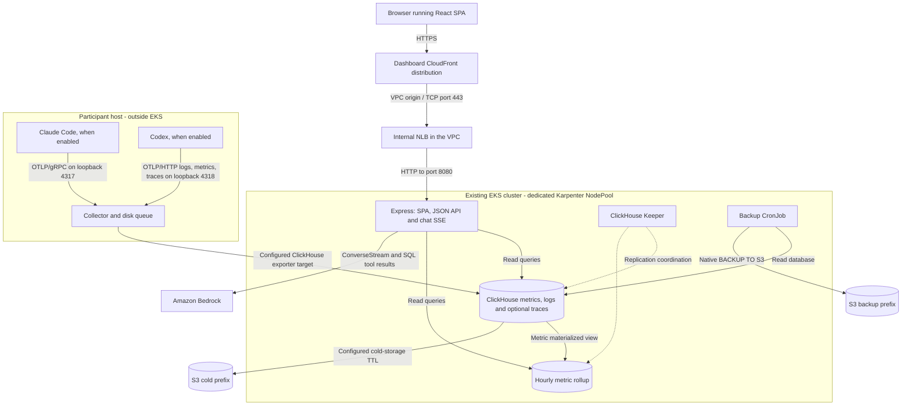

# Architecture

Claude Code Usage Dashboard collects selectable Claude Code telemetry and Codex native
OTel logs, metrics and traces for a workshop cohort. Shared views present usage, spend and operational
measurements; Claude retains its adoption/activity details and inferred `bedrock` and
`enterprise` session channels. Channels are neither client identities nor randomized
experiment assignments. Activity scores do not establish employee performance or causal ROI.

This document describes current source contracts, not verified live deployment.
Canonical engineering instructions are in [AGENTS.md](../AGENTS.md), with scoped guidance
for [packaging](../dashboard/AGENTS.md), [server](../dashboard/server/AGENTS.md),
[web](../dashboard/web/AGENTS.md) and [infrastructure](../infra/AGENTS.md). Adjacent CLAUDE.md
files import those instructions. Follow the [documentation policy](documentation-policy.md).

## System boundaries

The diagram shows logical data and request paths. Collector destinations, credentials and
protocols require operator configuration; the repository does not prove these paths are
connected in a running environment.

The SPA and API are served by one Express process in one image; the browser does not query
ClickHouse directly. The collector writes telemetry independently of the dashboard API.
The static [site](../site/) and [video project](../video/) are separate from this runtime.

Shared client and Codex detail costs use
[known subtotals with partial-cost disclosure](decisions/ADR-013-known-cost-subtotals.md).
Missing costs do not erase usable reports/estimates; token completeness and collection
semantics remain separate.

## Ingestion and storage

[user-data.sh](../user-data.sh) configures participant EC2 hosts, enabled client installs,
managed Claude Code settings, process-scoped Codex settings, resource identity and the
supervised collector service. `CLAUDE_ENABLED=true` and `CODEX_ENABLED=false` are the
defaults; both false is invalid. `CODEX_BEDROCK_ENDPOINT` selects `mantle` (default) or
`runtime`. Dashboard, bootstrap and collection must use consistent settings.

Bootstrap requires staged configuration/launcher artifacts, validates the candidate,
and supervises Collector startup with bounded rollback. The queue persists across
restarts. These machines/services are outside Terraform's EKS workload scope; the
[runbook](runbooks/codex-telemetry.md) owns setup and recovery details.

[collector-config.yaml](../collector-config.yaml) receives OTLP gRPC on loopback port 4317
and OTLP HTTP on 4318. It allows eight Claude Code metrics, filters client log namespaces
in separate pipelines, and routes enabled client traces by service provenance.
Claude keeps its existing log scrub. Codex logs get `client=codex`, retain explicit
backend/user/project metadata, and lose inherited `experiment.group`, content fields
and bodies. Zero source time is replaced with observed time before insertion into
`otel_logs.Timestamp`; nonzero time and event identity are preserved.

The [Codex launcher](../scripts/codex-launch.py) enables native logs, metrics and traces
with process-scoped overrides and a trusted loopback backend header. Added Codex metric
and trace pipelines enforce strict attribute allowlists while preserving user and series
identity. [Migration 006](../clickhouse-migration-006.sql) adds four exporter-compatible
metric tables; Codex spans use existing `otel_traces`. Logs remain the Codex usage/cost
authority. `create_schema=false` requires schema setup first. The
[collection contract](runbooks/codex-telemetry.md#collection-contract) owns privacy and
pinned-exporter compatibility limits.
The collector's 1,000-batch disk queue uses `file_storage` and retries without an elapsed-time limit;
queue capacity is still finite. Supervision protects process continuity, not complete capture.

The checked-in collector uses a native ClickHouse TLS endpoint from `CH_HOST`/`CH_PORT`;
`user-data.sh` supplies a native-TLS example. Separately, Terraform declares an ingestion
CloudFront/NLB path to ClickHouse's HTTP port 8123. These are different protocols and are
not automatically interchangeable or wired together by this repository.

[infra/clickhouse.tf](../infra/clickhouse.tf) declares one ClickHouse shard with three
replicas and three Keeper replicas. The operator reconciles these custom resources.
The local [Compose stack](../dashboard/docker-compose.yml) instead starts single-node
ClickHouse, applying the root schema before synthetic seed inserts on first volume creation.

| Store | Role | Configured replicated retention |
|---|---|---|
| `otel_metrics_sum` | Raw counter datapoints and promoted dimensions | Cold at 90 days, delete at 180 |
| `otel_metrics_gauge` | Exporter-compatible gauge storage | Cold at 90 days, delete at 180 |
| `codex_metrics_{sum,gauge,histogram,exponential_histogram}` | Separate native Codex diagnostics, without usage rollups | Cold at 90 days, delete at 180 |
| `otel_metrics_sum_hourly` | Per-series hourly max/sum aggregates | Delete at 180 days; no cold move |
| `otel_logs` | Claude bare-name events such as `api_request`/`tool_result`, and `codex.*` events | Cold at 45 days, delete at 90 |
| `otel_traces` | Claude spans and Codex spans tagged by resource client | Cold at 45 days, delete at 90 |
| `schema_migrations` | Migration evidence ledger | Separate metadata table |

The [replicated schema](../infra/files/clickhouse-schema-replicated.sql) and
[local schema](../clickhouse-schema.sql) share measurement columns but differ in engines and
cold-storage configuration. Promoted fields avoid repeated map decoding; their existence
alone does not prove event coverage. See [data reference](reference/data.md) for field sources.

The rollup retains user identities, so indefinite retention would outlive raw-data deletion.
Its delete-only TTL also works when an existing rollup has no cold volume. The configured
coordination path ends in `otel_metrics_sum_hourly_v2`, reflecting migration 003's table-name
swap; cleanup must respect that path rather than infer ownership from the SQL table name.
The three-day query baseline lookback does not require retaining identities forever.

## Queries and displayed measures

[queries.js](../dashboard/server/queries.js) owns SQL and cumulative-counter differences.
For `AggregationTemporality=2`, repeated values are differenced per series rather than
summed; delta/legacy rows follow the interval-sum branch. The declared metric `SeriesKey`
includes `StartTimeUnix` to distinguish restarted process segments, except that
`claude_code.session.count` keeps its label-only key.

`incFlat` uses raw rows for spans at most four hours and hourly rollups otherwise, with raw
start-boundary correction. Minute charts use raw buckets; dimension-specific version,
effort, agent, language and project queries have local raw aggregations. Historical end
alignment, latest-hour approximation, bounded baselines and some existence/bucket boundaries
remain. No universal equality between all windows, snapshots and charts is claimed.

[grouping.js](../dashboard/server/grouping.js) classifies Claude sessions from retained rollup
model/organization signals. One user's sessions can span channels. Most identity queries
still use `UserEmail`; EndUserId fallback is query-specific. Model and project filters are
also query-specific: project filtering covers only four Usage queries, and its capability
probe checks logs only. `GROUP_MODE=single` changes presentation, not those SQL policies.
See the [API contract](api-reference.md) for endpoints, shapes, filters and caps.

Claude spend views adapt existing `reported_cost` through
[spend.js](../dashboard/web/src/spend.js), preserving server `cost`/`computed_cost` diagnostics.
Cost's computed comparison is opt-in. [costEfficiency.js](../dashboard/server/costEfficiency.js)
uses reported spend for LOC/commit ratios while retaining computed fields. Zero reports
with positive tokens are unpriced at these consumers; a valid zero remains zero. Positive
aggregates cannot establish complete reports. Neither reported nor computed estimates are
invoices or guaranteed billing bounds.

[clientMetrics.js](../dashboard/server/clientMetrics.js) supplies the common client API.
Claude retains counter differencing; Codex uses deduplicated structured completion logs.
The [data reference](reference/data.md) owns token subsets, null/presence semantics,
context/inference pricing tiers, identity and shared time boundaries. Costs distinguish
Claude reports from Codex AWS estimates; neither guarantees billing completeness.

The SPA shares range/filter/refresh state and runtime configuration. With both clients
enabled, it defaults to the common client view in
[Clients.jsx](../dashboard/web/src/pages/Clients.jsx); Claude `view=detail` restores its
detail pages. Common views omit Claude-only channel/project filters, which the common
API rejects, and keep unsupported measurements unavailable. CSVs follow visible table
columns and sorted rows; central `csv.js` masks exported `user` cells
when enabled. [Metrics](metrics.md) defines the arbitrary activity score, permission-decision
acceptance (including automatic decisions), timing proxies and unsupported beta results.
UI wording does not turn these into code-quality or labor-savings measurements.

## API, chat and trust boundary

[index.js](../dashboard/server/index.js) serves the SPA, wrapped GET data routes and
`POST /api/chat`. The wrapper validates ranges, applies endpoint filters, deduplicates
in-flight queries and caches promises per process for 320 seconds, capped at 2,000 entries.
The default-view warmer and browser quantization reduce repeat scans but do not guarantee
hits. JSON API responses use `Cache-Control: no-store` after authentication; the successful
chat SSE handler overrides that with `no-cache`.

`/api/config` reports enabled clients and the configured Codex endpoint. Disabled Claude
data routes return 404, its warmer is omitted, and its SQL chat returns 503.
Basic Auth is global except for `/healthz` and `/readyz`. Missing credentials fail startup
unless the explicit local-development bypass is set. Chat has a separate insecure opt-in
and requires a confirmed readonly database session. The reader profile enforces readonly
access; `queryReadonly` does not set it per request. Chat's SQL guard rejects unsupported
statement forms and table access, while query limits and timeout provide additional bounds.
Ordinary JSON data routes do not share chat's per-IP rate limiter.

[chat.js](../dashboard/server/chat.js) uses Bedrock ConverseStream with four tool-enabled
rounds, at most eight SQL calls, and a possible final tool-disabled summary. The active SQL
result path returns at most 200 rows. Its `capToolResultJson` character-cap helper exists
but is unused. Browser disconnects cancel Bedrock work, but the handler does not pass the
external abort signal to SQL; SQL retains its own timeout.

The hardcoded chat prompt still describes computed-primary spend and rollup-only dashboard
queries. Those statements lag the actual consumers and query branches; this reconciliation
does not change the prompt. See [chat reference](reference/agent-llm.md) for exact limits.

PII masking is a display policy, not API authorization: ordinary data responses retain raw
identities. The server defaults it off, Terraform defaults it on, and the browser keeps it on
unless config explicitly disables it. Chat masks SQL/error emails, with documented limits
for streamed text and session identifiers. See [security](reference/security.md).

## Infrastructure and operational ownership

[infra/data.tf](../infra/data.tf) looks up an existing EKS cluster, VPC, subnets, OIDC provider,
node role, hosted zone and certificate. [nodepool.tf](../infra/nodepool.tf) adds a dedicated
arm64/on-demand Karpenter NodePool and EC2NodeClass; it does not create a cluster or an EKS
managed node group. Karpenter and ClickHouse/Keeper operators are prerequisites. Region
`ap-northeast-2` and node type `m8g.xlarge` are source defaults, not assertions about a fleet.

[dashboard.tf](../infra/dashboard.tf) declares two replicas, rolling-update/disruption
controls, preferred anti-affinity, Secret-backed credentials and Bedrock IRSA. CloudFront
VPC origins reach internal TCP NLB listeners; TLS ends at CloudFront, and the declared
origin path uses HTTP even though the NLB port is 443. ECR declares immutable image tags;
actual image rollout is owned separately because Terraform ignores later image-field changes.
See [IaC](reference/iac.md) for resource ownership and [runtime](reference/infrastructure.md)
for packaging and probes.

Schema changes can recreate the hash-named schema-init Job, which waits for completion.
A failed Job may still have applied some DDL. `CREATE IF NOT EXISTS` does not reconcile all
existing definitions. Migrations, segment-key materialization and rollup rebuilds require
explicit procedures and evidence; `/api/config` probes and the ledger are useful but do not
certify all historical parts or replicas. Migration 005 adds project/entrypoint columns
without changing the rollup or forcing materialization of those simple map lookups.

Health and alerts have distinct responsibilities:

- `/healthz` always returns HTTP 200, exposing ping status without restarting a healthy
  process during a database outage; `/readyz` fails on database failure or shutdown.
- `/api/health/data` reports stale/unknown telemetry with HTTP 503, using the latest
  enabled Claude metric or Codex log timestamp. One fresh client can hide another's gap;
  this is not a per-client completeness check. Optional webhooks run per replica.
- The optional CloudFront 5xx alarm/SNS path detects edge failures, not silent ingestion
  gaps. Neither alert path covers every failure, including backup-job failures.
- Native database backups target the S3 `backup/` prefix, whose lifecycle expires objects
  after 30 days. Cold data uses table TTL. Configuration and replication do not prove a
  usable backup, measured recovery time or completed restore.

Use the [deployment](runbooks/deploy-production.md), [schema migration](runbooks/schema-migrations.md),
[rollup rebuild](runbooks/rollup-rebuild-segment-key.md), [incident](runbooks/incident-response.md),
[backup](runbooks/backup-and-restore.md), [alerting](runbooks/alerting.md) and
[Codex telemetry](runbooks/codex-telemetry.md) runbooks for operations. The Codex runbook
records bounded raw API compatibility evidence and the unverified live CLI boundary.
CI in [.github/workflows/ci.yml](../.github/workflows/ci.yml) and PR review in
[pr-review.yml](../.github/workflows/pr-review.yml) are separate from deployment. Their
checks and current-HEAD review requirements are owned by the canonical instructions and
[review runbook](runbooks/pr-review-panel.md).

Key rationale is recorded in [ADR-001](decisions/ADR-001-local-diff-over-shared-incflat-extension.md)
(local query dimensions), [ADR-002](decisions/ADR-002-bedrock-identity-fallback.md) (identity scope),
[ADR-003](decisions/ADR-003-fold-start-time-into-series-key.md) (counter segments),
[ADR-009](decisions/ADR-009-reported-spend-with-computed-diagnostics.md) (reported spend), and
[ADR-010](decisions/ADR-010-english-documentation-and-review-context.md) (English documentation
and bounded trusted review context). Decisions describe intent; code and deployment evidence
establish implementation and runtime state.
